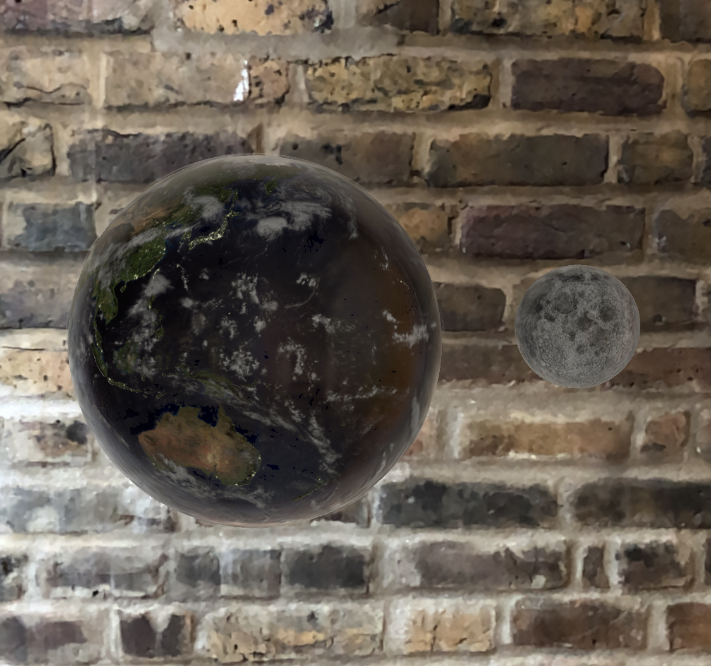

# AREarthOrbit

Warm up exercise from Ray Wenderlich's 'ARKit by Tutorials' book, v3.0.0.
This project displays a rotating earth with an orbiting moon in ARKit with
rendering and animation performed by SceneKit (not the newer RealityKit).

## Environment

- ARKit by Tutorials, 3.0.0
- Xcode 11.3
- iOS 13.2
- ARKit 3 with SceneKit

## Example

