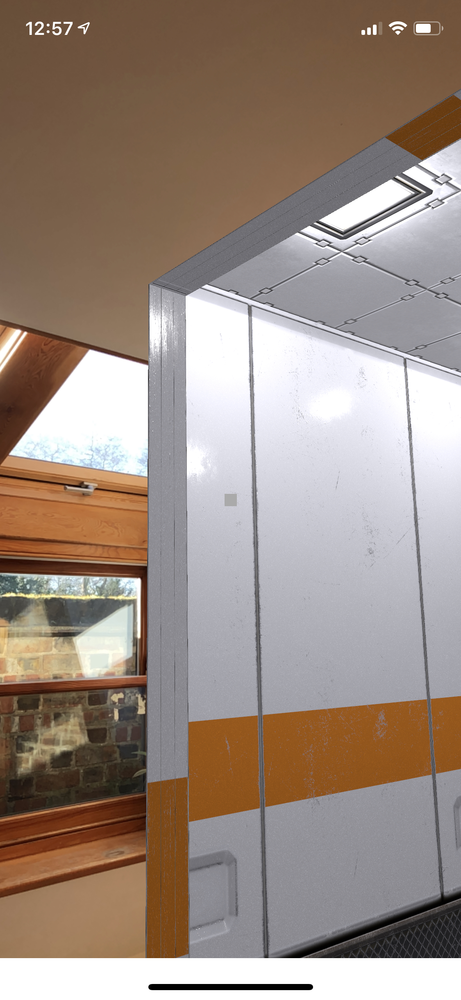

# ARPortal

Chapter 7-9 exercise from Ray Wenderlich's 'ARKit by Tutorials' book, v3.0.0.
This project creates a portal door through which a user can enter and find
themselves inside an AR room. Rendering is performed by SceneKit (not the
newer RealityKit).

## Environment

- ARKit by Tutorials, 3.0.0
- Xcode 11.3
- iOS 13.2
- ARKit 3 with SceneKit

## Example

