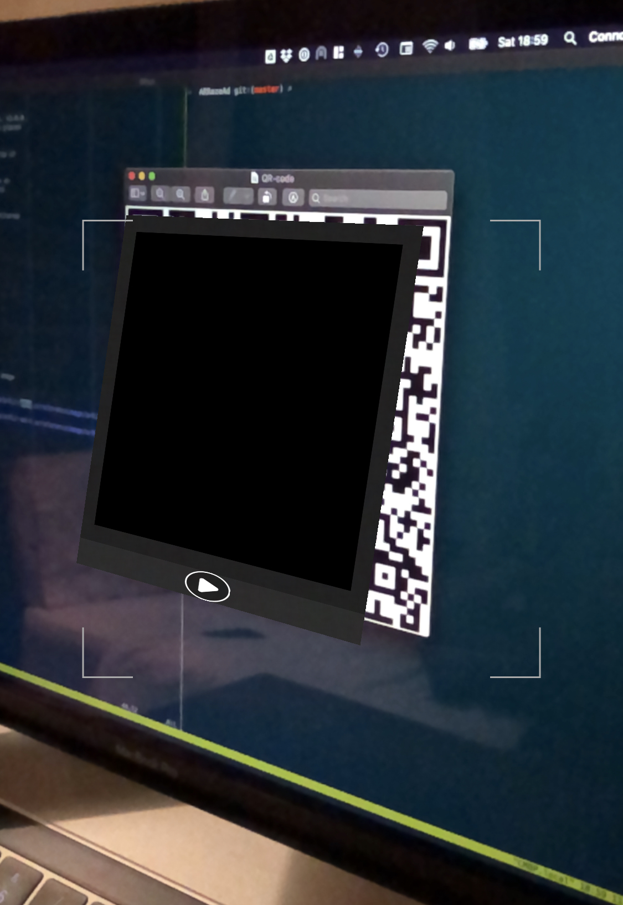

# ARPortal

Chapter 10-13 exercise from Ray Wenderlich's 'ARKit by Tutorials' book, v3.0.0.
This project serves to illustrate how interactive UIKit content can be placed
inside of an ARKit scene (rendered with SceneKit).

Image and QR code detection is used to overlay billboard content  on top of
recognized images or QR codes.

On the whole, the tutorial code is fairly rubbish. The resulting UI is an
eyesore and the code is poory architected. This was a faily substandard
example from Ray Wenderlich.

Chapter 13 (enabling AR features based on CoreLocation beacons and monitored
regions) was skipped.

## Environment

- ARKit by Tutorials, 3.0.0
- Xcode 11.3
- iOS 13.2
- ARKit 3 with SceneKit

## Recognized Images

### QR Code

### Images

These images should be printed on A4. If displayed on a screen, the image
should be zoomed to approximately A4 size.

## Example

